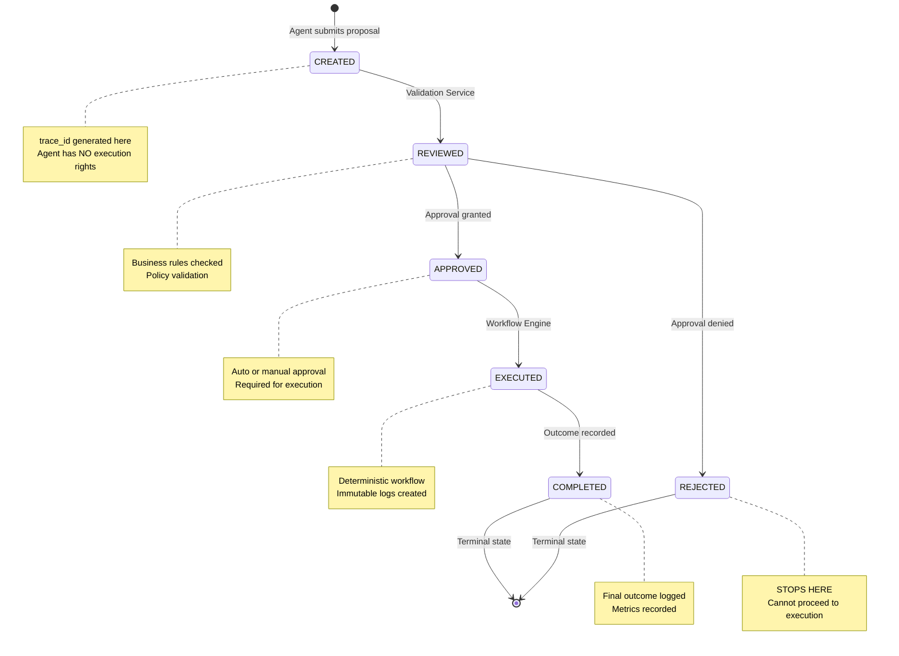
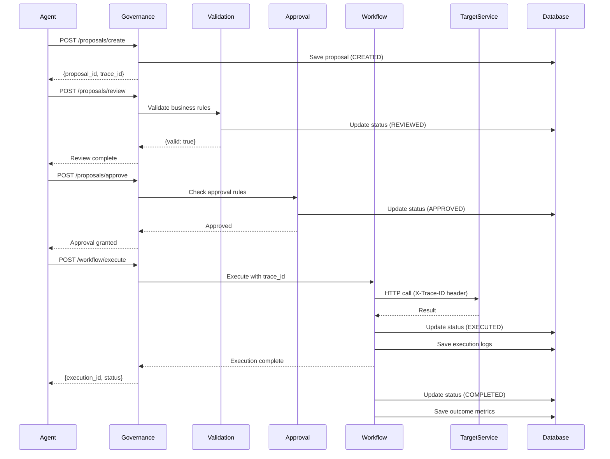
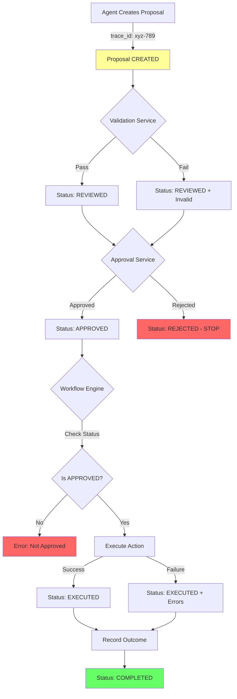
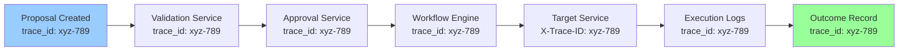
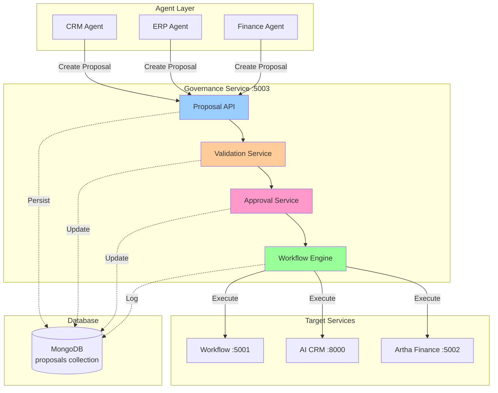

# 🔄 Governance Lifecycle - State Transitions

## Visual Flow Diagram

## Sequence Diagram

## Data Flow

## trace_id Propagation

## System Architecture

---

## Key Constraints

1. **No Direct Execution**: Agents → Governance → Target Services
2. **Status Enforcement**: APPROVED required for EXECUTED
3. **Immutable Logs**: Execution records cannot be modified
4. **trace_id Required**: Every stage must propagate trace_id
5. **Audit Trail**: All state transitions logged with timestamps
